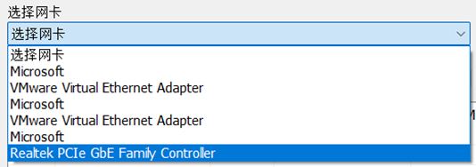

# MiniSniffer

个人网络嗅探器

## 系统功能模块

## 流程图

### WinPcap系统处理流程

### 程序总流程

### 包重组

## 主要数据结构

## analyz_frame数据包分析

## 界面设计

## 测试

### 抓包设置

#### 网卡选择

#### 过滤器设置

过滤规则样例：ether src 源MAC地址

​       ether dst 目的MAC地址

​       ip src 源IP地址

​       ip dst 目的IP地址

​       udp and (ip src 源IP地址 or ip dst 目的IP地址)

​       port 443 or port 80

图 8 侦听指定来源IP 地址的数据包

图 9 侦听指定目的 IP 地址的数据包

### 数据显示

#### 流量显示

#### 数据包列表

###  解析显示数据包

#### 显示原始数据

#### 统计数据包个数

### 数据包操作

#### 文件另存为

#### 打开源有数据包

####  包重组

先选择虚拟网卡

开始抓包

并在虚拟机里使用命令 ping 192.168.31.11 -s 10000 

结束抓包

选择分段数据包

点击IP重组

